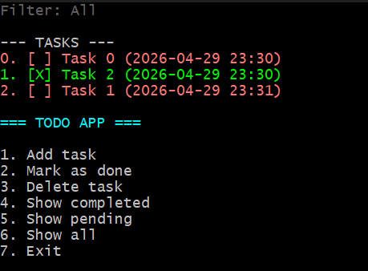

Todo App (C# Console)

Prosta aplikacja konsolowa do zarządzania zadaniami (To Do), napisana w C#.
Projekt stworzony jako część nauki podstaw programowania oraz przygotowania do praktyk.

----------------

Funkcjonalności

* Dodawanie nowych zadań
* Wyświetlanie listy zadań
* Oznaczanie zadania jako wykonane
* Usuwanie zadań
* Filtrowanie:
  * wszystkie
  * wykonane
  * niewykonane
* Zapisywanie danych do pliku (tasks.json)
* Blokada duplikatów (te same nazwy zadań)
* Kolorowy interfejs w konsoli

----------------

Technologie

* C#
* .NET
* System.Text.Json (serializacja danych)

----------------

Jak uruchomić

1. Sklonuj repozytorium:

git clone https://github.com/PawelTessmer/todo-app.git

2. Przejdź do folderu projektu:

cd todo-app

3. Uruchom aplikację:

dotnet run

----------------

Struktura projektu

* Program.cs – główna logika aplikacji
* TodoTask.cs – model zadania
* tasks.json – zapisane dane

----------------

Screenshot

----------------

Możliwe ulepszenia

* edycja zadania
* sortowanie (np. po dacie)
* GUI (np. WPF / WinForms)
* testy jednostkowe

----------------

Projekt wykonany samodzielnie w celach edukacyjnych.
